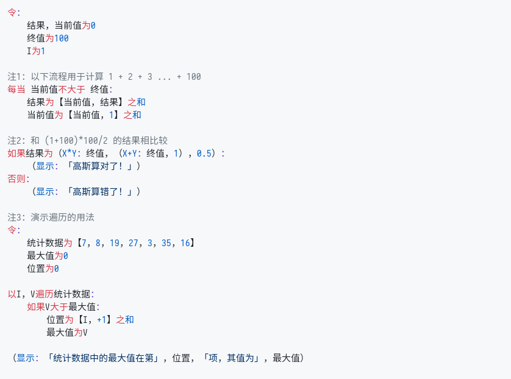

# Zn
_千里之行，始于足下。_

## 简介

`Zn` 是一门 _面向业务_ 的编程语言。

所谓「面向业务」，即是为用户开发业务代码时提供便利，使得用户能够快速根据真实需求投射出简洁、稳定、可维护的代码。`Zn` 在设计之初即强调「以人为本」，希望程序能够适应真实世界的需求而不是让开发者去适应代码逻辑。

为此，`Zn` 拥有以下独特的特性：

- 采用 **中文关键词及标点符号**。这样再也不用为「用英文命名变量」之事发愁了。
- 默认使用 **高精度小数** 作为数值并参与运算，杜绝因浮点数计算所带来的计算误差。
  > 这一点对开发金融应用尤为关键。显然，诸如 `0.1 + 0.2 = 0.30000000000000004` 这样的结果在金融应用中是无法忍受的。
- 贴近汉语本身语法，阅读代码可以像阅读文章一样自然。
- 关键词之间不必用空格分隔。

## 快速开始

_注1：`Zn` 采用 Go 语言开发，安装前请确保 Go 语言编译器已安装在机器上。（建议版本 `>= 1.11`）_  
_注2：因为GitHub暂不支持对 Zn 进行语法高亮，为保证显示效果，以下代码皆用截图显示。_

### 下载及安装
```sh
# 下载 Zn 语言
$ git clone https://github.com/reg0007/Zn.git

# 编译相应的文件
# 如果不方便运行 shell 脚本 （如使用 Windows 操作系统），用以下命令替代亦可
# cd Zn
# go build -o zn
# go build -o znt ./cmd/znt
$ cd Zn && ./build.sh

# 查看 Zn 语言版本
$ ./zn -v
```

### 进入交互模式

Zn 支持在命令行中以交互的方式返回结果（亦即REPL）。在命令行中直接输入 `zn` ，即可进行交互模式。

交互模式运行时，当前行的前面会显示 `Zn>` 做为标识符。在 `>` 号后即可直接输入完整的表达式或者语句。如果中途发现有地方需要修改，即可使用 `左方向键` 及 `右方向键` 移动光标到对应的位置以编辑；输入完成后，敲击回车键即可直接执行，运行结果将直接在后面显示。

以下即为使用交互模式的一个例子，你可以切换到中文输入法，试着体验下：
  > 注1：下文中出现的直角引号 `「 」` 也可以用普通的双引号 `“ ”` 代替，如：  
  > `令BAT为【“字节”，“阿里”，“腾讯”】`，下同 。
  >
  > 注2：按 `Ctrl + C` 即可退出交互执行模式。

```sh
$ ./zn
Zn> 令BAT为【「字节」，「阿里」，「腾讯」】
Zn> 令鹅厂为BAT#2
Zn> （显示：鹅厂）
腾讯
```

### 执行代码

Zn 语言目前亦支持执行某个文件中的程序，其格式为 `zn <待执行文件名>` （如 `zn 快速排序.zn`）。文件路径可以是相对于当前目录的路径，亦可以是绝对路径。

虽然Zn对于待执行文件的后缀名并没有要求，但是这里仍然建议代码文件以 `.zn` 做为后缀名保存。

> ⚠️ 代码文件须以 `utf-8` 编码储存，若以其他编码（包括`gb2312`, `gbk`）执行文件将会报错。

## 语法简介

#### 变量命名

Zn 鼓励使用中文用以变量命名，这样即免去了用英文命名的负担。变量名称可以使用中英文及数字<sup>1</sup>，亦支持 `-`, `/`, `*`, `_` 等字符。如 `pkgName`, `公交车站-数目`, `昨天的星座_02`, `MERS/SARS病例数` 皆为合法的变量名。

> 注1：数字不能作为变量名的第一个字符。

Zn 的关键词与变量名之间毋须使用空格分隔，故对于一串字符而言，Zn 会优先匹配出其中可能的关键词，剩下的字符再当作变量名；故而变量名不能包含 `令`, `为`, `如果`, `每当` 等 _关键字_。<sup>2</sup>

> 注2：若是变量名须包含 _关键字_，可在变量名前后各加一 `·` 符号（间隔号）以分隔。如 `·将军令·`, `·华为手机·`

#### 变量声明及赋值

所有变量须先声明再赋值，直接对未声明的变量赋予初值是不合法的行为。变量声明通过 _声明语句_ 来完成，使用声明语句会同时给予变量以初值。变量赋值通过 _赋值表达式_ 完成，这个操作将会给予变量以新值。

- 声明语句：`令 〔变量名〕 为 〔初始值〕`
- 赋值表达式： `〔变量名〕 为 〔新值〕`

以下为示例：


_[原始代码片段见此](./doc/snippets/quick01/变量声明.zn)_

#### 流程控制

Zn 支持三种流程控制语句： `如果`，`每当` 及 `遍历`；它们分别类比 JS 中的 `if`, `while`, `for.. in..`语句。具体用法如下所示：

- 如果语句： `如果 〔判断表达式〕： ⏎〔语句块〕`

若是 _判断表达式_ 的执行结果为 `真`，则执行「如果」后面的语句块<sup>3</sup>；否则若定义「否则」子句，则自然而然执行「否则」后面的语句块。

> 注3：Zn 以缩进来区分语句块。一个缩进单元为 `4个空格` 或者 `1个Tab`。同一个文件里的所有缩进类型要么都是空格，要么都是Tab，不能空格和Tab混用。后面的所有语句亦然。

- 每当语句： `每当 〔判断表达式〕： ⏎〔语句块〕`

当判断表达式值为 `真`，则下属语句块会循环往复执行。若是中途需要跳出循环，则在语句块中加入 `此之（结束）`；若是提前中止本次循环，即时开始下一次循环，则使用 `此之（继续）`。

- 遍历语句： `遍历 〔对象〕： ⏎〔语句块〕`

遍历语句将数组/列表对象的值从头至尾遍历一遍，并在每一次遍历中执行下属的语句块。

以下为示例：


_[原始代码片段见此](./doc/snippets/quick01/流程控制.zn)_

#### 方法创建和调用

所谓「方法」，即是平常所说的「函数」：它封装了一系列语句，并可通过一系列参数导出返回值。

- 定义方法语句：`如何 〔方法名〕 ？ ⏎ 已知〔接受参数列表〕  ⏎〔执行语句块〕`

定义一个方法需要三个要素：`方法名`，`接受参数列表`，`执行语句块`。`方法名`标示了这个方法的名称，到时调用方法即通过此名称以寻找到对应的逻辑；`接受参数列表` 定义了此方法可以接受的所有参数的信息以及其顺序；`执行语句块` 则负责执行具体逻辑以返回结果。

- 调用方法表达式：`（〔方法名〕：〔实际参数列表〕）`

调用方法则实际传入一系列参数，并执行对应的方法逻辑以得到结果。

> 注意：两侧的括号一定是中文括号！

以下为示例：


_[原始代码片段见此](./doc/snippets/quick01/方法调用.zn)_

#### 对象定义及使用

和大多数面向对象编程的语言一样，Zn 亦支持定义一个类并新建其实例。对象和类的概念在大多数面向对象的语言里都有涉及，这里就不再赘述了。

类的定义以 `定义` 关键词开始，紧跟着是这个类的名称；再然后是一个语句块，用于定义其所有属性及方法。其语法大致如下：

```
定义 〔类名〕：
    〔属性列表〕
    〔构造方法〕    
    〔计算属性列表〕
    〔方法列表〕    
```

- 属性列表： `其 〔属性名〕 为 〔初值〕`

属性即是在对象中存储的特定数据。属性列表即表明由该类所新建的实例（对象）中所能拥有的所有属性值。每一个属性都需要定义初值，这些值即是其实例中对应属性的初始值。

属性列表中的所有属性皆可读/写。

- 构造方法： `是为 〔形参列表〕`

构造方法虽名为「方法」，但是实际上它只能定义这个类在构造时的形参列表。每一个形参都是已定义的属性名称，在初始化对象时即会将参数直接赋值到对应的属性中。

- 计算属性列表： `何为 〔属性名〕？  ⏎ 〔语句块〕`

计算属性和属性类似，只不过其值并非直接获得，而是需要通过一定逻辑计算而得。（类似于 JavaScript 中的 `getter`）

- 方法列表： `如何 〔方法名〕？  ⏎ 〔语句块〕`

方法列表定义了对象可以执行的所有方法。

**如何初始化对象**

在定义了类名之后，其对应的实例可以通过 `令 〔对象名〕 成为 〔类名〕：〔参数列表〕` 获得。

获取一个对象的属性值可以用 `〔对象名〕 之 〔属性名〕` 得到；

调用一个对象的方法可以用 `〔对象名〕 之 （〔方法名〕：〔参数列表〕）` 完成；

在类方法中可以使用 `其 〔属性名〕` 做为当前对象的属性值；（类似于 `this.xxx`）；

以下为示例：


_[原始代码片段见此](./doc/snippets/quick01/对象定义.zn)_

## 了解更多

- 如欲了解具体的语法细则，请参阅 [用户手册](./doc/manual/README.md)
- 欢迎大家一同贡献代码，让 Zn 语言变得更好美好。不妨先参阅 [开发指南] 以更加了解 Zn 的代码架构。 _TODO_

## 开发清单

- [ ] 完成用户手册的编写 (rev04)
- [ ] 补充 `exec` 模块的单元测试
- [ ] 开发 `Zn for VSCode` 插件，支持语法高亮
- [ ] 添加数据类型的常用方法
- [ ] 添加 `对于` 关键字 (rev05)
- [ ] 添加异常处理 (rev05)

## 开源许可

此软件采用 `BSD-3` 开源许可，敬请注意其适用范围：

```
Copyright (c) 2020, Zn Dev Group
All rights reserved.

Redistribution and use in source and binary forms, with or without
modification, are permitted provided that the following conditions are met:
    * Redistributions of source code must retain the above copyright
      notice, this list of conditions and the following disclaimer.
    * Redistributions in binary form must reproduce the above copyright
      notice, this list of conditions and the following disclaimer in the
      documentation and/or other materials provided with the distribution.
    * Neither the name of the Zn dev group nor the
      names of its contributors may be used to endorse or promote products
      derived from this software without specific prior written permission.

THIS SOFTWARE IS PROVIDED BY THE COPYRIGHT HOLDERS AND CONTRIBUTORS "AS IS" AND
ANY EXPRESS OR IMPLIED WARRANTIES, INCLUDING, BUT NOT LIMITED TO, THE IMPLIED
WARRANTIES OF MERCHANTABILITY AND FITNESS FOR A PARTICULAR PURPOSE ARE
DISCLAIMED. IN NO EVENT SHALL ZN DEV GROUP BE LIABLE FOR ANY
DIRECT, INDIRECT, INCIDENTAL, SPECIAL, EXEMPLARY, OR CONSEQUENTIAL DAMAGES
(INCLUDING, BUT NOT LIMITED TO, PROCUREMENT OF SUBSTITUTE GOODS OR SERVICES;
LOSS OF USE, DATA, OR PROFITS; OR BUSINESS INTERRUPTION) HOWEVER CAUSED AND
ON ANY THEORY OF LIABILITY, WHETHER IN CONTRACT, STRICT LIABILITY, OR TORT
(INCLUDING NEGLIGENCE OR OTHERWISE) ARISING IN ANY WAY OUT OF THE USE OF THIS
SOFTWARE, EVEN IF ADVISED OF THE POSSIBILITY OF SUCH DAMAGE.
```
